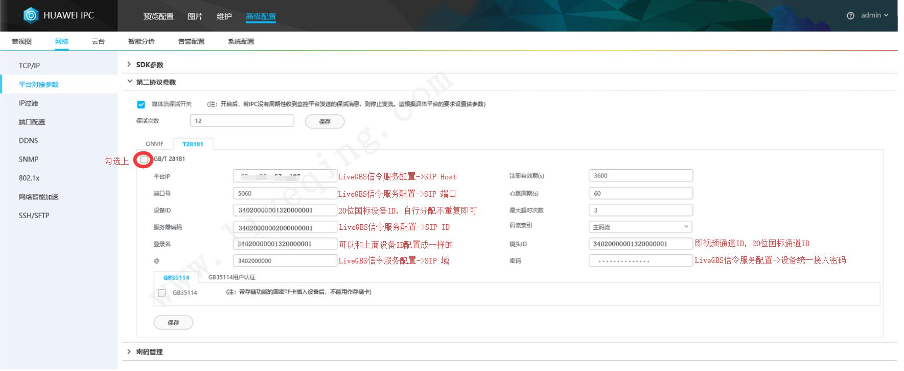

# LiveGBS GB28181 国标方案安装使用说明

## 服务资源

[试用安装包下载](https://www.liveqing.com/docs/download/LiveGBS.html) | [在线演示](http://gbs.liveqing.com/) | [在线API](http://gbs.liveqing.com/apidoc) | [前端源码](https://gitee.com/livegbs/GB28181-Server) | QQ交流群：[605916552](https://jq.qq.com/?_wv=1027&k=cEUIvaNw)

## [](https://www.liveqing.com/docs/manuals/LiveGBS.html#%E6%9C%8D%E5%8A%A1%E6%9E%B6%E6%9E%84)服务架构


## [](https://www.liveqing.com/docs/manuals/LiveGBS.html#%E6%9C%8D%E5%8A%A1%E8%AF%B4%E6%98%8E)服务说明

### [](https://www.liveqing.com/docs/manuals/LiveGBS.html#%E4%B8%8B%E8%BD%BD%E5%AE%89%E8%A3%85%E5%8C%85)下载安装包

[下载 LiveGBS 安装包](https://www.liveqing.com/docs/download/LiveGBS.html)，先上传部署包到服务器， 再解压

- Windows平台使用的安装包：
  
  ```
    LiveCMS-windows-***.zip
    LiveSMS-windows-***.zip
  ```

- Linux平台使用的安装包：
  
  ```
    LiveCMS-linux-***.tar.gz
    LiveSMS-linux-***.tar.gz
  ```

### [](https://www.liveqing.com/docs/manuals/LiveGBS.html#%E4%BF%A1%E4%BB%A4%E6%9C%8D%E5%8A%A1)信令服务

- LiveCMS
  
  SIP 中心信令服务, 单节点, 自带一个 Redis Server, 随 LiveCMS 自启动, 不需要手动运行

- LiveCMS 端口使用
  
  TCP 端口 : 15060(SIP 和设备通信), 10000(HTTP 浏览器访问), 26379(Redis Server, **不建议对外开放**)
  
  UDP 端口 : 15060(SIP 和设备通信), 10000(HTTP 浏览器访问)

### [](https://www.liveqing.com/docs/manuals/LiveGBS.html#%E6%B5%81%E5%AA%92%E4%BD%93%E6%9C%8D%E5%8A%A1)流媒体服务

- LiveSMS
  
  SIP 流媒体服务, 根据需要可部署多套

- LiveSMS 端口使用
  
  TCP 端口 : 15070(SIP 和 LiveCMS 通信), 10001(HTTP 和 LiveCMS 通信), 11935(RTMP Live), 30000-30249(RTP over TCP 接收设备推流)
  
  UDP 端口 : 15070(SIP 和 LiveCMS 通信), 10001(HTTP 和 LiveCMS 通信), 30000-30249(RTP/RTCP over UDP 接收设备推流), 30250-30500(WebRTC over UDP 浏览器播放)

### [](https://www.liveqing.com/docs/manuals/LiveGBS.html#%E9%85%8D%E7%BD%AE%E4%BF%A1%E4%BB%A4%E6%9C%8D%E5%8A%A1-livecms)配置信令服务(LiveCMS)

```
服务名称：LiveCMS

配置文件：livecms.ini

所在位置：LiveCMS-windows-***.zip, LiveCMS-linux-***.tar.gz

WEB管理：LiveGBS->基础配置->信令服务配置
```

- [sip] -> host
  
  SIP 中心信令服务器 IP，WEB基础配置界面-》信令服务配置-》SIP Host

- [sip] -> serial
  
  SIP 中心信令服务器 ID，WEB基础配置界面-》信令服务配置-》SIP ID

- [sip] -> realm
  
  SIP 中心信令服务器 Realm，WEB基础配置界面-》信令服务配置-》SIP 域

- [sip] -> device_password
  
  设备接入统一密码，WEB基础配置界面-》信令服务配置-》设备统一接入密码

### [](https://www.liveqing.com/docs/manuals/LiveGBS.html#%E9%85%8D%E7%BD%AE%E6%B5%81%E5%AA%92%E4%BD%93%E6%9C%8D%E5%8A%A1-livesms)配置流媒体服务(LiveSMS)

```
 服务名称：LiveSMS

 配置文件：livesms.ini

 所在位置：LiveSMS-windows-***.zip, LiveSMS-linux-***.tar.gz

 WEB管理：LiveGBS->基础配置->流媒体服务配置
```

- [sip] -> host
  
  SIP 流媒体服务器 IP，WEB基础配置界面-》流媒体服务配置-》本地|内网 IP

- [sip] -> serial
  
  SIP 流媒体服务器 ID，WEB基础配置界面-》流媒体服务配置-》SIP ID

- [sip] -> realm
  
  SIP 流媒体服务器 Realm，WEB基础配置界面-》流媒体服务配置-》SIP 域

- [sip] -> wan_ip (可选配置)
  
  SIP 流媒体服务器公网 IP，WEB基础配置界面-》流媒体服务配置-》外网IP(可选)

- [sip] -> use_wan_ip_recv_stream (可选配置)
  
  可选配置0/1, 指示流媒体服务器使用公网 IP 接收国标下级流数据，WEB基础配置界面-》流媒体服务配置-》外网IP收流（勾选项）

- [rtp] -> udp_port_range
  
  RTP over UDP 端口区间

- [rtp] -> tcp_port_range
  
  RTP over TCP 端口区间

## [](https://www.liveqing.com/docs/manuals/LiveGBS.html#%E6%9C%8D%E5%8A%A1%E8%BF%90%E8%A1%8C)服务运行

注意

安装包所在路径不能包含 **中文**

**运行成功后，访问 LiveGBS WEB 管理页面**

WEB后台管理（默认端口10000），浏览器地址栏输入 http://ip:10000 访问 如：[http://127.0.0.1:10000](http://127.0.0.1:10000/)

开启了HTTPS后，浏览器地址栏输入 https://ip:port 访问，默认用户名/密码为 admin/admin

### [](https://www.liveqing.com/docs/manuals/LiveGBS.html#windows)Windows

**方式一：直接运行**

信令服务（LiveCMS）

- 启动: 解压目录中，直接双击 LiveCMS.exe，服务会以图标方式展示在任务栏上，可以右击服务图标，点击 `打开` WEB后台管理

- 停止：右击任务栏上服务图标，点击 `退出` 服务运行

流媒体服务（LiveSMS）

- 启动: 解压目录中，直接双击 LiveSMS.exe，服务会以图标方式展示在任务栏上

- 停止：右击任务栏上服务图标，点击 `退出` 服务运行

**方式二：以服务启动**

信令服务（LiveCMS）

- 安装: 解压目录中，直接双击 ServiceInstall-LiveCMS.exe

- 卸载: 以 ServiceUninstall-LiveCMS.exe 卸载 CMS 服务

流媒体服务（LiveSMS）

- 安装: 解压目录中，直接双击 ServiceInstall-LiveSMS.exe

- 卸载: 以 ServiceUninstall-LiveSMS.exe 卸载 SMS 服务

### [](https://www.liveqing.com/docs/manuals/LiveGBS.html#linux)Linux

**方式一：直接运行**

信令服务（LiveCMS）

```
tar xvf LiveCMS-linux-***.tar.gz
cd LiveCMS-linux-***

#启动:
./livecms

#停止:
Ctrl + C
```

流媒体服务（LiveSMS）

```
tar xvf LiveSMS-linux-***.tar.gz
cd LiveSMS-linux-***

#启动:
./livesms

#停止:
Ctrl + C
```

**方式二：以服务启动**

信令服务（LiveCMS）

```
tar xvf LiveCMS-linux-***.tar.gz
cd LiveCMS-linux-***

#启动:
./start.sh

#停止:
./stop.sh
```

流媒体服务（LiveSMS）

```
tar xvf LiveSMS-linux-***.tar.gz
cd LiveSMS-linux-***

#启动:
./start.sh

#停止:
./stop.sh
```

## [](./images/LiveCMS.jpg)配置设备接入

**不需要在平台侧预录设备，只需配置设备接入，设备注册成功自动出现在 国标设备 -> 设备列表**，参考 LiveGBS 后台管理 -> 基础配置 -> 信令服务配置; 把在这里看到的接入参数设置到下级设备或平台上。 

下面是海康、大华和宇视 IPC 中, GB28181 平台接入的配置截图, 供参考

### [](https://www.liveqing.com/docs/manuals/LiveGBS.html#%E6%B5%B7%E5%BA%B7gb28181%E6%8E%A5%E5%85%A5%E7%A4%BA%E4%BE%8B)海康GB28181接入示例


### [](https://www.liveqing.com/docs/manuals/LiveGBS.html#nvr%E7%A1%AC%E4%BB%B6gb28181%E6%8E%A5%E5%85%A5%E7%A4%BA%E4%BE%8B)NVR硬件GB28181接入示例

说明：视频通道编码ID，如果配置为空表示不作为通道接入到LiveGBS。如下图所示，只有通道1和通道2会接入到LiveGBS。


### [](https://www.liveqing.com/docs/manuals/LiveGBS.html#%E5%A4%A7%E5%8D%8Egb28181%E6%8E%A5%E5%85%A5%E7%A4%BA%E4%BE%8B)大华GB28181接入示例


### [](https://www.liveqing.com/docs/manuals/LiveGBS.html#%E5%AE%87%E8%A7%864g-gb28181%E6%8E%A5%E5%85%A5%E7%A4%BA%E4%BE%8B)宇视4G GB28181接入示例


### [](https://www.liveqing.com/docs/manuals/LiveGBS.html#%E5%8D%8E%E4%B8%BAipc-gb28181%E6%8E%A5%E5%85%A5%E7%A4%BA%E4%BE%8B)华为IPC GB28181接入示例



## [](https://www.liveqing.com/docs/manuals/LiveGBS.html#%E5%B9%B3%E5%8F%B0%E4%BD%BF%E7%94%A8)平台使用

### [](https://www.liveqing.com/docs/manuals/LiveGBS.html#%E7%AE%A1%E7%90%86%E5%B9%B3%E5%8F%B0)管理平台

http://localhost:10000

### [](https://www.liveqing.com/docs/manuals/LiveGBS.html#%E6%8E%A5%E5%8F%A3%E6%96%87%E6%A1%A3)接口文档

http://localhost:10000/apidoc

### [](https://www.liveqing.com/docs/manuals/LiveGBS.html#%E4%BD%BF%E7%94%A8%E5%88%86%E4%BA%AB%E9%A1%B5)使用分享页

为方便客户在网页中集成播放功能, 我们单独提供了可供 HTML iframe 集成的分享页, （默认不分享，可在 国标设备->查看通道列表 开启分享）形如:

```
<!-- 直播 -->
<iframe src="http://ip:10000/play.html?serial=34020000001110000001&code=34020000001320000001&aspect=fullscreen" allowfullscreen allow="autoplay; fullscreen; microphone;"></iframe>
```

其中 URL 参数:

- serial 设备国标编号

- code 通道国标编号

- share 是否显示分享, 可选, yes/no, 默认值为 yes

- ptz 是否显示云台控制, 可选, yes/no, 默认值为 yes

- talk 是否显示对讲麦克风, 可选, yes/no, 默认值为 no

- aspect 配置只显示视频播放区域, 同时指定宽高比, 可选, wxh, 例如 640x360, 即16:9, 当 aspect=fullscreen 时, 整页显示播放器

- fluent 是否以流畅模式播放, 可选, yes/no, 默认值为 yes

- autoplay 是否自动播放, 可选, yes/no, 默认值为 yes

- controls 是否显示播放器控制栏, 可选, yes/no, 默认值为 yes

- stretch 是否拉伸显示, 可选, yes/no, 默认值为 no

- muted 是否播放器静音, 可选, yes/no, 默认值为 yes

- protocol 播放流格式, 可选, webrtc/flv/ws_flv/hls/rtmp, 默认 auto check

```
<!-- 时间轴回放 -->
<iframe src="http://ip:10000/playback.html?type=device&serial=34020000001110000001&code=34020000001320000001" allowfullscreen allow="autoplay; fullscreen"></iframe>
```

其中 URL 参数:

- type 回放类型, 设备录像/云端录像, 可选, device/cloud, 默认值为 device

- serial 设备国标编号

- code 通道国标编号

- day 当前日期, 可选, YYYYMMDD, 默认值为 当天

- minutes 当前时间轴游标位置, 可选, 0~1439, 默认值为 当前时间

- calendar 是否显示日历, 可选, yes/no, 默认值为 yes

- autoplay 是否自动播放, 可选, yes/no, 默认值为 yes

- controls 是否显示播放器控制栏, 可选, yes/no, 默认值为 yes

- stretch 是否拉伸显示, 可选, yes/no, 默认值为 no

- muted 是否播放器静音, 可选, yes/no, 默认值为 yes

- protocol 播放流格式, 设备录像有效, 可选, webrtc/flv/ws_flv/hls/rtmp, 默认 auto check

### [](https://www.liveqing.com/docs/manuals/LiveGBS.html#%E7%BD%91%E9%A1%B5%E6%92%AD%E6%94%BE%E5%99%A8)网页播放器

除了 iframe 方式集成播放器, 也可以使用 LivePlayer 网页播放器来二次开发

LivePlayer 网页播放器下载和使用文档, 参阅 [LivePlayer使用说明](https://www.liveqing.com/docs/manuals/LivePlayer.html)

## [](https://www.liveqing.com/docs/manuals/LiveGBS.html#%E7%BB%9F%E4%B8%80%E7%BC%96%E7%A0%81%E8%A7%84%E5%88%99)统一编码规则

关于SIP ID, 设备ID, 通道ID, 以下是国标协议文档中关于 **统一编码规则** 的截取


## [](https://www.liveqing.com/docs/manuals/LiveGBS.html#%E6%9C%8D%E5%8A%A1%E5%99%A8%E7%A1%AC%E4%BB%B6%E9%85%8D%E7%BD%AE)服务器硬件配置


