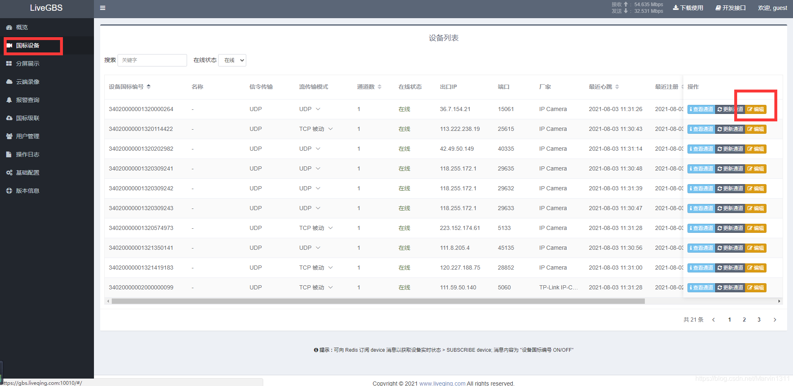
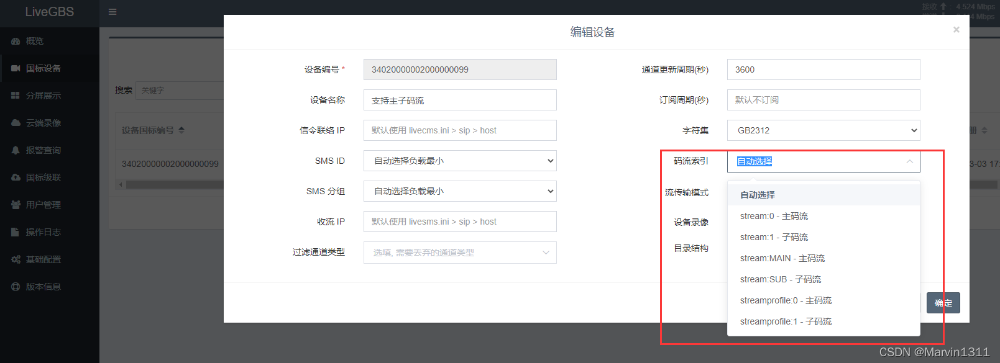
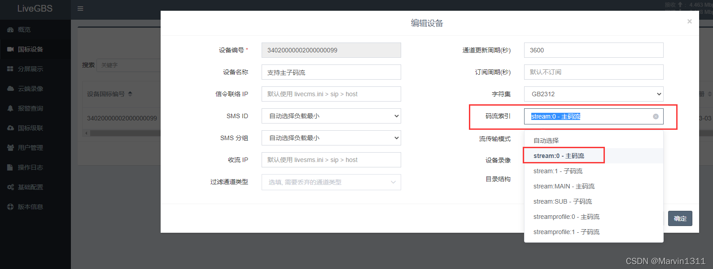
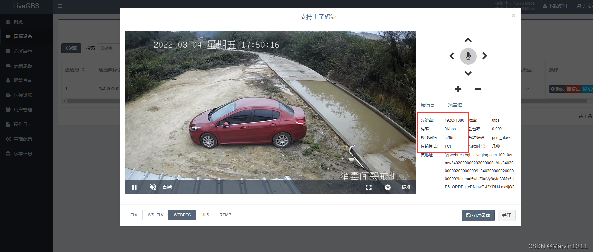
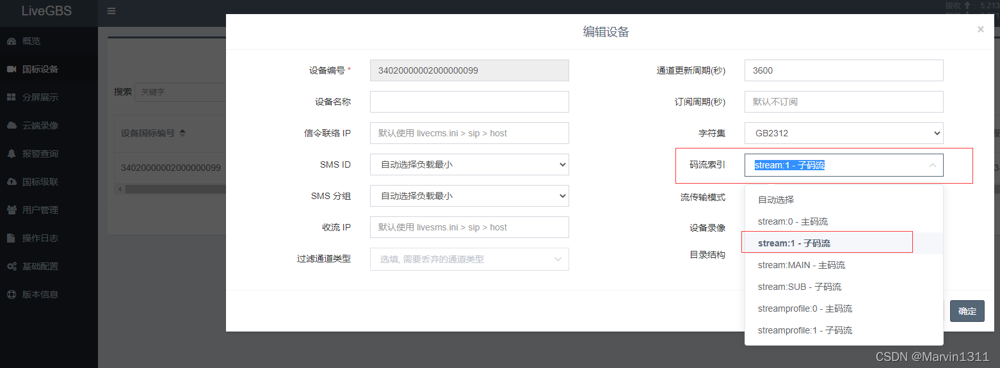
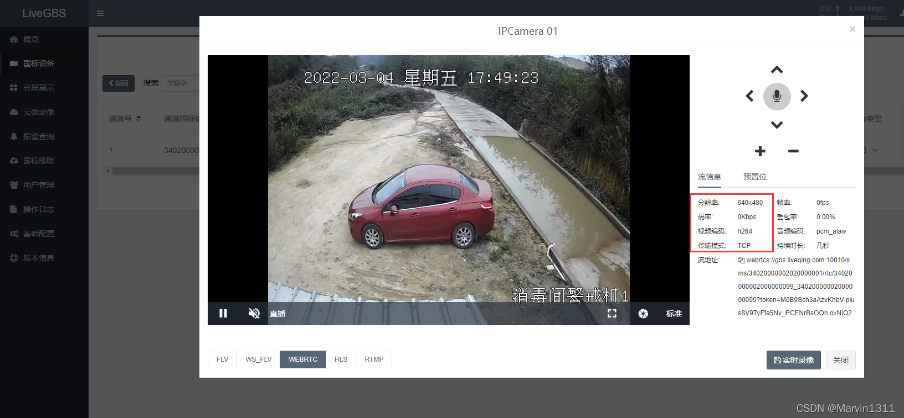

# LiveGBS国标GB/T28181流媒体平台支持主子码流切换主码流stream/streamprofile

```
1、主子码流切换
	1.1、国标设备编辑
	1.2、配置码流索引
		1.2.1、配置主码流
			1.2.1.1、主码流播放
		1.2.2、配置子码流
			1.2.2.1、子码流播放
2、相关问题
	2.1、所有设备都支持吗？
3、搭建GB28181视频直播平台
```

## 1、主子码流切换 ##

**1.1、国标设备编辑**

国标设备菜单-》编辑



1.2、配置码流索引



1.2.1、配置主码流



1.2.1.1、主码流播放



1.2.2、配置子码流



1.2.2.1、子码流播放



## 2、相关问题 ##

**2.1、所有设备都支持吗？**

不是所有的摄像头设备都支持，LiveGBS支持信令的主子码流切换，同样需要设备实现的支持，上面测试播放的设备是：TP-Link IP-Camera，判断设备是否支持可以编辑配置码流索引，尝试播放。

## 3、搭建GB28181视频直播平台 ##

- 支持 Windows Linux 及其它CPU架构（国产、嵌入式…）操作系统
- [安装包下载](https://www.liveqing.com/docs/download/LiveGBS.html) 、 [安装使用说明](https://www.liveqing.com/docs/manuals/LiveGBS.html)、 [WEB前端源码](https://github.com/livegbs/GB28181-Server)

————————————————

版权声明：本文为CSDN博主「Marvin1311」的原创文章，遵循CC 4.0 BY-SA版权协议，转载请附上原文出处链接及本声明。

原文链接：https://blog.csdn.net/Marvin1311/article/details/126126000
